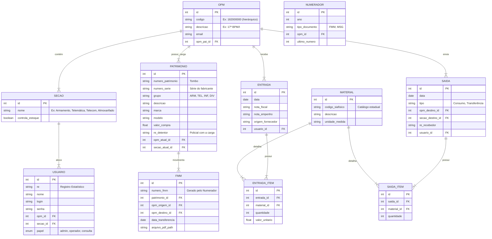
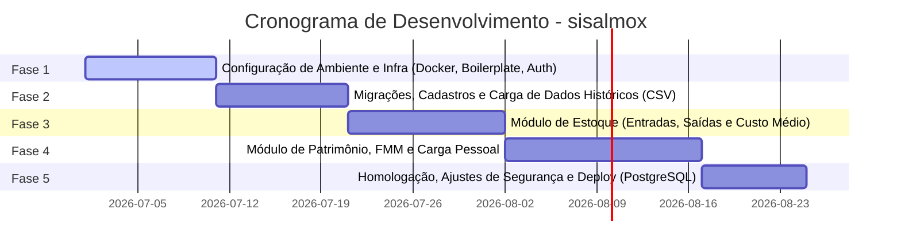

# Análise de Viabilidade Arquitetural: Integração vs. Sistema Independente

Esta análise técnica avalia se as regras de negócio do sistema de **Almoxarifado** legado (`almox`) devem ser integradas ao projeto **sispatrimonio** em desenvolvimento ou se devem formar uma nova aplicação separada.

---

## 1. Avaliação Comparativa dos Caminhos

### Caminho A: Integrar ao `sispatrimonio` Existente
Consiste em adicionar os módulos de Estoque, FMM, Carga Pessoal e Telecomunicações ao projeto de suporte e controle físico de TI atual.

* **Reaproveitamento de Código (Alto)**: Reutiliza a configuração de banco de dados, Dockerfiles, middlewares de autenticação básica (JWT) e layouts do frontend.
* **Complexidade do Banco de Dados (Crítica)**: O modelo de `Equipamento` simples do `sispatrimonio` seria inflado com campos específicos de Material Bélico, contas contábeis da Fazenda, incorporações UGE, e estados de estoque físico/consumíveis.
* **Segurança e Níveis de Permissão (Conflitantes)**: O `sispatrimonio` possui permissões simples (`admin`, `operador`, `consulta`). O `almox` exige uma matriz restritiva baseada no código hierárquico da OPM (`$opmroot`) e no setor (Armamento, Telecom, etc.), o que obrigaria a reescrever todos os middlewares de autorização do sistema atual.
* **Risco de Concorrência (Alto no SQLite)**: Em um cenário com múltiplos operadores de diferentes OPMs registrando entradas, saídas e gerando sequenciadores FMM, o banco SQLite de arquivo único integrado sofreria com travamentos de escrita (*Database Locked*).

---

### Caminho B: Desenvolver um Novo Sistema Separado (`sisalmox`)
Consiste em criar uma nova aplicação isolada, espelhando a infraestrutura do `sispatrimonio` mas com base de código e banco de dados independentes.

* **Separação de Domínios (Excelente)**: Mantém o controle de logística militar (Armamento, FMMs, estoque com custos médios e termos contábeis) isolado do sistema de chamados de suporte e inventário básico de TI.
* **Arquitetura Limpa e Manutenibilidade (Alta)**: Alterações nos módulos de estoque ou nos relatórios de carga pessoal não geram efeitos colaterais na gestão de chamados do `sispatrimonio`.
* **Banco de Dados Escalável**: Permite projetar um esquema específico para entradas/saídas contábeis de estoque e histórico imutável de movimentações de material permanente.
* **Facilidade de Deploy (Garantida via Docker)**: Ambos os sistemas podem rodar no mesmo servidor em containers separados (`sistemapatrimonio` e `sisalmox`), compartilhando apenas um Nginx/Traefik como proxy reverso.

---

## 2. Matriz de Decisão Arquitetural

| Ponto de Avaliação | Integração ao `sispatrimonio` | Novo Sistema Separado (`sisalmox`) | Decisão Técnica |
| :--- | :--- | :--- | :--- |
| **Complexidade de Domínio** | Mistura inventário simples com logística militar e bélica complexa. | Permite modelar o fluxo militar e contábil sem restrições. | **Separar** |
| **Concorrência de Escrita** | Alto risco de *locks* no SQLite devido à grande frequência de logs. | SQLite isolado (dev) e migração para Postgres facilitada. | **Separar** |
| **Segurança e Permissões** | Exigiria refatoração geral do Auth básico do sistema atual. | Controle matricial (OPM x Seção) nativo desde o início. | **Separar** |
| **Arquitetura de Banco** | Tabelas com muitas colunas nulas (*bloated tables*). | Modelagem em 3NF (Terceira Forma Normal) limpa. | **Separar** |
| **Esforço Inicial** | Menor a curto prazo, maior a médio/longo prazo. | Médio para setup inicial, muito menor para manutenção. | **Separar** |

---

## 3. Recomendação Objetiva

> [!IMPORTANT]
> **Recomendação: Iniciar um Novo Sistema Separado (`sisalmox`).**
> 
> As regras do Almoxarifado representam um sistema de **Logística Militar Contábil e de Material Bélico**. Agrupá-lo com o `sispatrimonio` (que possui finalidade voltada para chamados de suporte de TI e inventário local via QR Code) viola o princípio de responsabilidade única (*Single Responsibility Principle*), aumenta os riscos de brechas de segurança de dados sigilosos (como cargas de armamento) e introduz alto acoplamento técnico.

O novo sistema deve herdar as melhores escolhas tecnológicas do `sispatrimonio` (Node, Express, Sequelize, React/Vite, Tailwind, Docker), mas operar de forma autônoma.

---

## 4. Proposta de Estrutura Inicial do Novo Sistema (`sisalmox`)

### A. Estrutura de Pastas Sugerida

```text
sisalmox/
├── backend/
│   ├── src/
│   │   ├── config/             # Configurações (db, e-mail, JWT)
│   │   ├── database/           # Conexão, migrations e seeders
│   │   ├── models/             # Entidades Sequelize
│   │   ├── controllers/        # Controladores das rotas
│   │   ├── middlewares/        # Validação de token e filtro de OPM
│   │   ├── routes/             # Endpoints da API
│   │   ├── utils/              # FPDF/PDFKit, parser de CSV e envio de e-mails
│   │   └── server.js           # Inicialização do Express
│   ├── Dockerfile
│   └── package.json
├── frontend/
│   ├── src/
│   │   ├── assets/             # Imagens, brasões da PMESP
│   │   ├── components/         # Botões, tabelas paginadas, modais
│   │   ├── pages/              # Login, Dashboard, FMM, Estoque, CargaPessoal
│   │   ├── services/           # Comunicação com a API (axios)
│   │   └── index.css           # Configurações do Tailwind
│   ├── Dockerfile
│   └── package.json
└── docker-compose.yml          # Orquestração (backend, frontend, postgres)
```

---

### B. Entidades do Banco de Dados (Modelos Sequelize)

Para cobrir as regras de negócio legadas, propõe-se o seguinte esquema no Sequelize:



---

### C. Etapas de Desenvolvimento Propostas

Para garantir uma entrega segura e incremental, o projeto deve ser dividido em 5 fases:



1. **Fase 1: Setup da Infraestrutura e Autenticação (10 dias)**
   * Configuração do Docker Compose.
   * Criação do servidor Node/Express e estruturação do banco.
   * Middleware de autenticação baseado em RE com validação de OPM.
   * Configuração básica do React com Vite/TailwindCSS.

2. **Fase 2: Estrutura de Cadastro e Migração (10 dias)**
   * Criação das migrações do Sequelize para OPMs, Seções, Usuários e Materiais.
   * Desenvolvimento do importador de dados em lote (CSV) com as regras extraídas de `tratarCsv.php`.
   * Telas de cadastro de patrimônios e busca no frontend.

3. **Fase 3: Módulo de Estoque e Consumíveis (12 dias)**
   * Implementação da lógica de entradas e saídas de estoque.
   * Lógica do cálculo de valor médio mensal de materiais (baseado na lógica de `valormediomensal` do PHP).
   * Telas de lançamento de entradas e requisição de saídas.

4. **Fase 4: Módulo de Movimentação (FMM) e Carga Pessoal (15 dias)**
   * Lógica do sequenciador numérico de documentos por OPM (`Numerador`).
   * Motor de PDF utilizando PDFKit/Puppeteer para gerar a FMM idêntica ao modelo original.
   * Emissão do relatório de **Carga Pessoal** filtrando por RE ou tipo de material (Pistola, Colete, Algema).
   * Lógica de envio automático de e-mail de alerta para telecomunicações.

5. **Fase 5: Segurança, Auditoria e Deploy (8 dias)**
   * Implementação de log de auditoria imutável (guardando quem alterou cargas e estoques).
   * Migração do banco SQLite para PostgreSQL através de variáveis de ambiente do Docker Compose.
   * Testes integrados de concorrência e controle de acessos por OPM.
